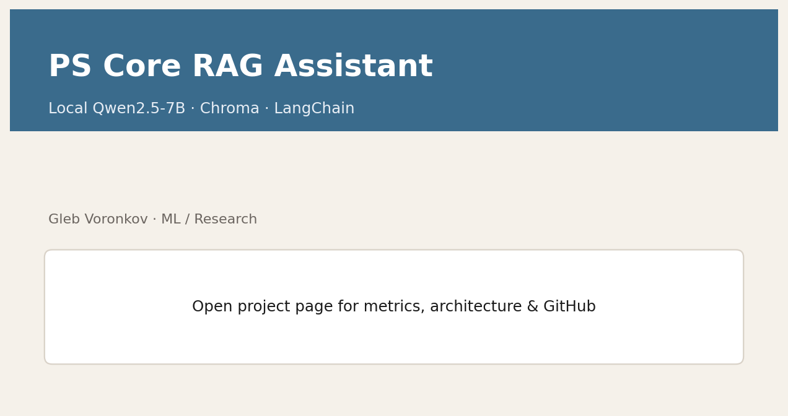
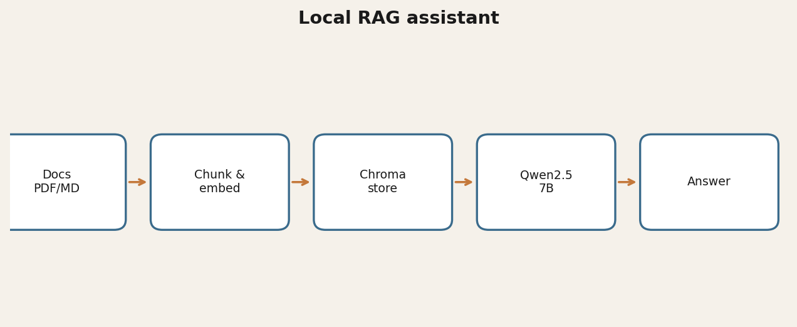

# PS Core RAG Assistant

Local **RAG chatbot** for packet-core / telecom engineering documentation.

[](https://www.python.org/)
[](LICENSE)
[](https://glebvoronkov03.github.io/gleb-web-portfolio/projects/rag.html)

Stack: **LangChain + ChromaDB + Hugging Face embeddings + Ollama (Qwen2.5:7B)**.

> Author: Gleb Voronkov · Apache-2.0

## Demo



## Why it matters
Engineers waste time searching multi-hundred-page standards. This assistant builds a **local** vector knowledge base from documents and answers in RU/EN **without sending data to the cloud** (after models are pulled).

## Architecture



```
PDF/MD docs → RecursiveCharacterTextSplitter → HF embeddings (all-MiniLM-L6-v2)
        → Chroma persistent store → Ollama Qwen2.5:7B → answer
```

## Quickstart
1. Install [Ollama](https://ollama.com) and pull: `ollama pull qwen2.5:7b`
2. Run:
   ```powershell
   python -m venv .venv
   # Windows: .\.venv\Scripts\Activate.ps1  |  Linux/macOS: source .venv/bin/activate
   pip install -r requirements.txt
   python src/ai_assistant_complete.py
   ```
3. Put docs into `data/` (synthetic sample included), build the knowledge base from the menu, ask questions.

## Results
- Public repo ships **synthetic sample docs only** (production used larger private corpora)
- Typical local answers often **5–40 s** for Qwen2.5:7B on a capable NVIDIA box

## License & citation
Apache-2.0. Contact: `mybook3@mail.ru` / `@Gleb_Voronkov`.

## Links
- Portfolio: [https://glebvoronkov03.github.io/gleb-web-portfolio/projects/rag.html](https://glebvoronkov03.github.io/gleb-web-portfolio/projects/rag.html)
- Related: [ai-team-orchestrator](https://github.com/GlebVoronkov03/ai-team-orchestrator)
